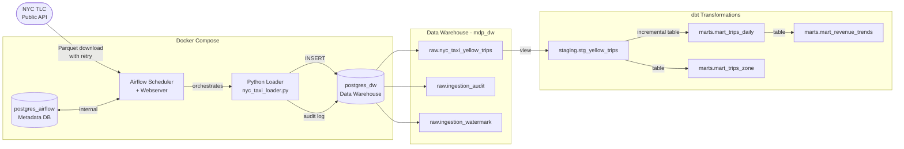

# modern-data-pipeline

Production-style end-to-end data pipeline using **Airflow**, **dbt** and **PostgreSQL**, built on real public data (NYC Taxi).

---

## Architecture



---

## Stack

| Layer | Tool | Purpose |
|---|---|---|
| Orchestration | Apache Airflow 2.9 | Schedule & monitor pipeline runs |
| Ingestion | Python + pandas + tenacity | Download, normalize and load Parquet files with retry logic |
| Storage | PostgreSQL 15 | Data Warehouse (separate from Airflow metadata DB) |
| Transformation | dbt 1.x + dbt-utils + dbt-expectations | Staging views + incremental mart tables + data quality tests |
| Containerization | Docker Compose | Fully reproducible local environment |
| Testing | pytest + pytest-cov | Unit tests for ingestion logic |

---

## Data Flow

```
NYC TLC API  →  raw.nyc_taxi_yellow_trips  →  staging.stg_yellow_trips  →  mart_trips_daily  →  mart_revenue_trends
                                                                          →  mart_trips_zone
```

1. **Airflow** runs daily and checks the watermark table to find the next unloaded month
2. **Python loader** downloads the monthly Parquet file (~40-100MB) with exponential-backoff retries, normalizes column names and bulk-inserts into `raw` via a connection pool
3. **Idempotent load**: existing rows for that month are deleted before insert — safe to re-run
4. **Audit table** records every execution: rows loaded, duration, status and any errors
5. **dbt** transforms raw data into clean staging views and aggregated mart tables; `mart_trips_daily` is incremental (only reprocesses the last 2 days on each run)

---

## Data Model

### Raw Layer
| Table | Description |
|---|---|
| `raw.nyc_taxi_yellow_trips` | All yellow taxi trips, loaded monthly from NYC TLC. Financial columns are `NUMERIC(10,2)` to avoid float rounding errors |
| `raw.ingestion_watermark` | Tracks last successfully loaded month per source |
| `raw.ingestion_audit` | One row per pipeline execution with status, row count and duration |

### Staging Layer (dbt views)
| Model | Description |
|---|---|
| `staging.stg_yellow_trips` | Cleaned trips: renamed columns, type casts, basic quality filters |

### Marts Layer (dbt tables)
| Model | Materialization | Description |
|---|---|---|
| `marts.mart_trips_daily` | Incremental | Daily aggregates: trips, revenue, distance, tips. Upserts last 2 days on each run |
| `marts.mart_trips_zone` | Full refresh | Lifetime aggregates by pickup zone: volume, revenue, avg fare. Full refresh by design — zone totals depend on all historical data |
| `marts.mart_revenue_trends` | Table | Window function analysis on top of `mart_trips_daily`: 7-day moving avg, WoW growth %, monthly revenue rank, demand trend classification |

---

## Quickstart (Windows / Docker Desktop)

```bash
git clone https://github.com/Joao-Data-Engineer/modern-data-pipeline.git
cd modern-data-pipeline
cp .env.example .env   # edit credentials before starting
docker compose up -d
```

Airflow UI will be available at **http://localhost:8080** (`admin` / `admin`) once init completes (~30s).

### Run dbt transformations

```bash
cd transformations
pip install dbt-postgres
dbt deps --profiles-dir .             # install dbt-utils + dbt-expectations
dbt debug --profiles-dir .            # verify connection
dbt run --profiles-dir .              # build all models
dbt test --profiles-dir .             # run data quality tests
dbt docs generate --profiles-dir . && dbt docs serve --profiles-dir .
```

### Run unit tests

```bash
pip install -r requirements.txt
pytest tests/ -v --cov=ingestion
```

---

## Validate Results

After triggering the DAG in Airflow, connect to the DW and run:

```sql
-- Check raw data
SELECT source_file, count(*) as rows, min(tpep_pickup_datetime), max(tpep_pickup_datetime)
FROM raw.nyc_taxi_yellow_trips
GROUP BY source_file;

-- Check pipeline audit log
SELECT month, status, rows_loaded, duration_secs, started_at
FROM raw.ingestion_audit
ORDER BY started_at DESC;

-- Check daily mart
SELECT trip_date, total_trips, total_revenue, avg_fare
FROM marts.mart_trips_daily
ORDER BY trip_date DESC
LIMIT 10;

-- Top pickup zones
SELECT pickup_zone_id, total_trips, total_revenue, avg_fare
FROM marts.mart_trips_zone
ORDER BY total_trips DESC
LIMIT 10;

-- Revenue trends with WoW growth
SELECT trip_date, day_of_week, total_revenue, revenue_7d_moving_avg,
       revenue_wow_growth_pct, demand_trend, revenue_rank_in_month
FROM marts.mart_revenue_trends
ORDER BY trip_date DESC
LIMIT 14;
```

---

## Project Structure

```
modern-data-pipeline/
├── dags/
│   └── nyc_taxi_ingest.py          # Airflow DAG (incremental, idempotent, retries)
├── ingestion/
│   └── nyc_taxi_loader.py          # Download (retry) → normalize → load + audit
├── tests/
│   └── test_loader.py              # pytest unit tests for ingestion logic
├── transformations/
│   ├── dbt_project.yml
│   ├── profiles.yml                # dev / ci / prod targets
│   ├── packages.yml                # dbt-utils + dbt-expectations
│   └── models/
│       ├── staging/
│       │   ├── sources.yml         # source freshness checks
│       │   ├── stg_yellow_trips.sql
│       │   └── schema.yml          # not_null, accepted_values, range tests
│       └── marts/
│           ├── mart_trips_daily.sql      # incremental model
│           ├── mart_trips_zone.sql       # full refresh (lifetime aggregate)
│           ├── mart_revenue_trends.sql   # window functions: LAG, moving avg, RANK
│           └── schema.yml
├── warehouse/
│   └── schema.sql                  # raw schema + audit + watermark + indexes
├── docker-compose.yml              # 2x Postgres + Airflow (init/webserver/scheduler)
├── requirements.txt
└── .env.example
```

---

## CI/CD

GitHub Actions pipeline on every push/PR to `main`:

```
lint → unit-test → dbt-test → notify-failure (on failure only)
```

| Job | What it does |
|---|---|
| `lint` | `ruff check` + `ruff format --check` on `ingestion/` and `dags/` |
| `unit-test` | `pytest tests/` with coverage report |
| `dbt-test` | Spins up a real Postgres 15, seeds 82 rows via `generate_series`, runs `dbt deps` + `dbt run` + `dbt test` |
| `notify-failure` | Opens a GitHub Issue with run URL and failure context |

---

## Troubleshooting

**`dbt: command not found` / not recognized**

dbt is installed but not in the PATH. Fix for the current session:

```bash
# Windows (PowerShell)
$env:PATH += ";$env:LOCALAPPDATA\Packages\PythonSoftwareFoundation.Python.3.13_qbz5n2kfra8p0\LocalCache\local-packages\Python313\Scripts"

# Or use the full path directly
python -m dbt run --profiles-dir .
```

To fix permanently: add the Scripts folder to your system PATH in Settings → System → Environment Variables.

---

**`dbt test` fails with `Option '--profiles-dir' requires an argument`**

The `.` (dot) at the end is required — it tells dbt to look for `profiles.yml` in the current directory:

```bash
# Correct
dbt test --profiles-dir .

# Wrong — missing the dot
dbt test --profiles-dir
```

---

**Airflow webserver not starting / `localhost:8080` unreachable**

The webserver waits for `airflow-init` to complete. Check init logs:

```bash
docker logs mdp_airflow_init
```

If init is still running, wait 30 seconds and refresh. If it exited with errors, run:

```bash
docker compose down -v --remove-orphans
docker compose up -d
```

---

**Port 5432 already allocated**

Another process is using the port. Find and stop it:

```bash
# Windows
netstat -ano | findstr :5432
taskkill /PID <pid> /F

# Then restart
docker compose down -v --remove-orphans
docker compose up -d
```

---

## Key Design Decisions

**Two separate Postgres instances** — `postgres_airflow` handles Airflow internal metadata only. `postgres_dw` is the actual data warehouse. Mixing both in one DB is an anti-pattern in production.

**Idempotent loads** — Each run deletes and reloads by `source_file`. Safe to re-trigger on failure without duplicating data.

**Watermark pattern** — `raw.ingestion_watermark` tracks the last loaded month per source. The pipeline always knows where to resume without scanning the entire table.

**ELT over ETL** — Raw data lands in the warehouse first, transformations happen inside the DB with dbt. This preserves the original data and makes transformations versionable and testable.

**dbt layers** — `raw → staging → marts` follows the standard analytics engineering pattern. Staging is a view (always fresh), marts are tables (pre-aggregated for query performance).

**Incremental models** — `mart_trips_daily` uses `materialized='incremental'` with a 2-day lookback window. Only the most recent dates are reprocessed on each run, avoiding a full table scan. `mart_trips_zone` is intentionally kept as a full refresh because zone totals are lifetime aggregates — a partial recompute would produce wrong counts.

**NUMERIC for financial data** — All monetary columns use `NUMERIC(10,2)` instead of `DOUBLE PRECISION` to avoid IEEE 754 floating-point rounding errors (e.g., `14.0 + 0.3 ≠ 14.3` in float arithmetic).

**Resilient ingestion** — `download_parquet()` uses exponential-backoff retries (up to 3 attempts) via `tenacity`. The SQLAlchemy engine is configured with a `QueuePool` to reuse connections across tasks instead of creating a new connection per run.
