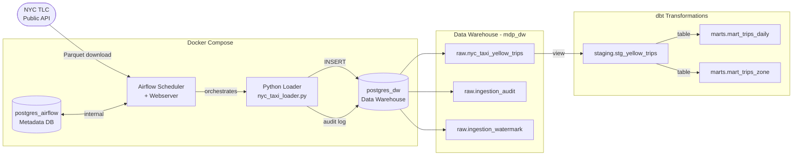

# modern-data-pipeline

Production-style end-to-end data pipeline using **Airflow**, **dbt** and **PostgreSQL**, built on real public data (NYC Taxi).

---

## Architecture



---

## Stack

| Layer | Tool | Purpose |
|---|---|---|
| Orchestration | Apache Airflow 2.9 | Schedule & monitor pipeline runs |
| Ingestion | Python + pandas | Download, normalize and load Parquet files |
| Storage | PostgreSQL 15 | Data Warehouse (separate from Airflow metadata DB) |
| Transformation | dbt 1.x | Staging views + analytics-ready mart tables |
| Containerization | Docker Compose | Fully reproducible local environment |

---

## Data Flow

```
NYC TLC API  →  raw.nyc_taxi_yellow_trips  →  staging.stg_yellow_trips  →  mart_trips_daily
                                                                          →  mart_trips_zone
```

1. **Airflow** runs daily and checks the watermark table to find the next unloaded month
2. **Python loader** downloads the monthly Parquet file (~40-100MB), normalizes column names and loads into `raw`
3. **Idempotent load**: existing rows for that month are deleted before insert — safe to re-run
4. **Audit table** records every execution: rows loaded, duration, status and any errors
5. **dbt** transforms raw data into clean staging views and aggregated mart tables

---

## Data Model

### Raw Layer
| Table | Description |
|---|---|
| `raw.nyc_taxi_yellow_trips` | All yellow taxi trips, loaded monthly from NYC TLC |
| `raw.ingestion_watermark` | Tracks last successfully loaded month per source |
| `raw.ingestion_audit` | One row per pipeline execution with status, row count and duration |

### Staging Layer (dbt views)
| Model | Description |
|---|---|
| `staging.stg_yellow_trips` | Cleaned trips: renamed columns, type casts, basic quality filters |

### Marts Layer (dbt tables)
| Model | Description |
|---|---|
| `marts.mart_trips_daily` | Daily aggregates: trips, revenue, distance, tips |
| `marts.mart_trips_zone` | Aggregates by pickup zone: volume, revenue, avg fare |

---

## Quickstart (Windows / Docker Desktop)

```bash
git clone https://github.com/Joao-Data-Engineer/modern-data-pipeline.git
cd modern-data-pipeline
docker compose up -d
```

Airflow UI will be available at **http://localhost:8080** (`admin` / `admin`) once init completes (~30s).

### Run dbt transformations

```bash
cd transformations
pip install dbt-postgres
dbt debug --profiles-dir .     # verify connection
dbt run --profiles-dir .       # build staging + mart models
dbt test --profiles-dir .      # run 17 data quality tests
dbt docs generate --profiles-dir . && dbt docs serve --profiles-dir .
```

---

## Validate Results

After triggering the DAG in Airflow, connect to the DW and run:

```sql
-- Check raw data
SELECT source_file, count(*) as rows, min(tpep_pickup_datetime), max(tpep_pickup_datetime)
FROM raw.nyc_taxi_yellow_trips
GROUP BY source_file;

-- Check pipeline audit log
SELECT month, status, rows_loaded, duration_secs, started_at
FROM raw.ingestion_audit
ORDER BY started_at DESC;

-- Check daily mart
SELECT trip_date, total_trips, total_revenue, avg_fare
FROM marts.mart_trips_daily
ORDER BY trip_date DESC
LIMIT 10;

-- Top pickup zones
SELECT pickup_zone_id, total_trips, total_revenue, avg_fare
FROM marts.mart_trips_zone
ORDER BY total_trips DESC
LIMIT 10;
```

---

## Project Structure

```
modern-data-pipeline/
├── dags/
│   └── nyc_taxi_ingest.py          # Airflow DAG (incremental, idempotent)
├── ingestion/
│   └── nyc_taxi_loader.py          # Download → normalize → load + audit
├── transformations/
│   ├── dbt_project.yml
│   ├── profiles.yml
│   └── models/
│       ├── staging/
│       │   ├── sources.yml
│       │   ├── stg_yellow_trips.sql
│       │   └── schema.yml          # dbt tests: not_null, accepted_values
│       └── marts/
│           ├── mart_trips_daily.sql
│           ├── mart_trips_zone.sql
│           └── schema.yml          # dbt tests: not_null, unique
├── warehouse/
│   └── schema.sql                  # raw schema + audit + watermark tables
├── docker/
├── docker-compose.yml              # 2x Postgres + Airflow (init/webserver/scheduler)
└── requirements.txt
```

---

## Key Design Decisions

**Two separate Postgres instances** — `postgres_airflow` handles Airflow internal metadata only. `postgres_dw` is the actual data warehouse. Mixing both in one DB is an anti-pattern in production.

**Idempotent loads** — Each run deletes and reloads by `source_file`. Safe to re-trigger on failure without duplicating data.

**Watermark pattern** — `raw.ingestion_watermark` tracks the last loaded month per source. The pipeline always knows where to resume without scanning the entire table.

**ELT over ETL** — Raw data lands in the warehouse first, transformations happen inside the DB with dbt. This preserves the original data and makes transformations versionable and testable.

**dbt layers** — `raw → staging → marts` follows the standard analytics engineering pattern. Staging is a view (always fresh), marts are tables (pre-aggregated for query performance).
